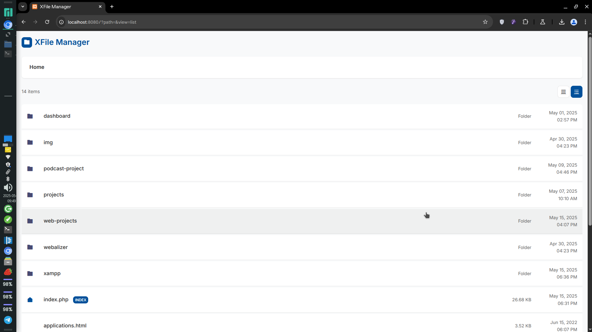

# XFile Manager 📁✨

 


A modern, professional, and beautifully designed file manager for XAMPP environments. This file manager replaces the default Apache directory listing with a sleek, responsive interface that delivers a superior local development experience.

<p align="center">
  
</p>

## ✨ Features

- 🌈 **Modern UI/UX** with grid and list views
- 🌐 **Responsive design** for desktop and mobile
- 📊 **File information** showing size, type and last modified date
- 🧭 **Breadcrumb navigation** for easy directory traversal
- 🔍 **File type icons** for quick visual identification
- 📥 **Direct download** of files with a single click
- 🔒 **Secure design** with protection against directory traversal
- 📱 **Mobile-friendly** interface that adapts to screen size
- 🚀 **Lightweight & fast** with minimal dependencies
- 📑 **Index file detection** and direct access
- 💼 **Professional styling** with beautiful colors and typography

## 📥 Installation

### Quick Setup

1. Download these three files:
   - `index.php` - The main file manager code
   - `.htaccess` - Apache configuration
   - `xfile_manager.php` - Compatibility helper file

2. Copy all three files to any directory in your XAMPP installation where you want the file manager to be available.

3. Ensure your XAMPP server is running (Apache service must be active).

4. Access the directory through your browser:
   ```
   http://localhost/your-directory/
   ```

### Step-by-Step Instructions

#### 1. Download the Files

Clone this repository or download the files individually:

```bash
git clone https://github.com/xMrDoctor/Apache.git
cd xfile-manager
```

#### 2. Place the Files in Your XAMPP Directory

Copy the three files to any directory where you want the file manager:

```bash
cp index.php .htaccess xfile_manager.php /path/to/xampp/htdocs/your-directory/
```

#### 3. Configure XAMPP

Make sure your XAMPP environment is properly configured:

1. Start the XAMPP Control Panel
2. Start the Apache service
3. Ensure PHP is enabled (PHP module should be active in Apache)

#### 4. Navigate to the Directory

Open your browser and navigate to:

```
http://localhost/your-directory/
```

#### 5. Troubleshooting

If you encounter any issues:
- Check that Apache is running properly
- Verify that .htaccess files are enabled in your Apache configuration
- Ensure PHP is properly configured in XAMPP
- Check file permissions (files should be readable by the web server)

## 🎮 Usage Guide

### Basic Navigation

- **Browse directories**: Click on any folder to navigate into it
- **Download files**: Click on any file to download it
- **Open index files**: Click on files marked with the "INDEX" badge to open them directly
- **Navigate up**: Use the breadcrumb navigation at the top to go back up the directory structure

### View Modes

XFile Manager offers two view modes that you can switch between:

1. **Grid View**: Displays files and folders as cards in a grid layout (default)
   - To activate: Click the grid icon in the toolbar
   
2. **List View**: Shows files and folders in a detailed list with more information
   - To activate: Click the list icon in the toolbar

<p align="center">
  
  
</p>

### File Types and Icons

XFile Manager automatically assigns appropriate icons to different file types:

- 📁 **Folders**: Displayed with a folder icon
- 🏠 **Index Files**: Shown with a home icon and an "INDEX" badge
- 📄 **Documents**: Text files, PDFs, Word documents, etc.
- 🖼️ **Images**: JPG, PNG, GIF, SVG, etc.
- 🎵 **Audio**: MP3, WAV, OGG, etc.
- 🎬 **Video**: MP4, AVI, MOV, etc.
- 🗜️ **Archives**: ZIP, RAR, TAR, etc.
- 💻 **Code**: HTML, CSS, JS, PHP, etc.

### Special Features

- **Empty Directory Notice**: When a folder contains no files, a helpful message is displayed
- **Index File Priority**: Index files appear at the top of the list for easy access
- **Auto-Redirect**: If a directory contains an index file, it will open automatically

## ⚙️ Configuration

XFile Manager is designed to work out of the box, but you can customize its behavior by editing the configuration section at the top of the `index.php` file.

### Customizable Options

```php
$config = [
    // Files and directories to hide from the listing
    'hide_files' => ['.', '..', '.htaccess', '.git', '.gitignore', '.DS_Store', 'Thumbs.db'],
    
    // File extensions to hide (e.g., ['tmp', 'log'])
    'ignored_extensions' => [],
    
    // Date format for file modified dates (using PHP's date function)
    'date_format' => 'M d, Y h:i A',
    
    // Theme colors for the UI
    'theme' => [
        'primary_color' => '#00509a',      // Main accent color
        'secondary_color' => '#484A72',    // Secondary color
        'text_color' => '#333333',         // Main text color
        'background_color' => '#f8f9fa',   // Page background
        'card_background' => '#ffffff'     // Card/item background
    ],
    
    // Default view mode (grid or list)
    'view_mode' => isset($_GET['view']) ? $_GET['view'] : 'grid',
    
    // Files that should be considered index files
    'index_files' => ['index.php', 'index.html', 'index.htm']
];
```

### Adjusting the Configuration

To modify the configuration:

1. Open `index.php` in a text editor
2. Locate the `$config` array at the top of the file
3. Edit the values as needed
4. Save the file and refresh your browser

### Advanced Configuration

For advanced users, you can also modify:

- The `.htaccess` file to change how Apache handles directory requests
- The CSS styles within `index.php` to customize the appearance further
- The PHP code to add new features or modify existing functionality

## 🧩 How It Works

XFile Manager consists of three key components:

1. **index.php**: The main file containing the file manager code and UI
2. **.htaccess**: Apache configuration that handles how directories are accessed
3. **xfile_manager.php**: A helper file that ensures compatibility with actual index files

When you access a directory:

1. Apache first checks if there's an actual index file (like index.php or index.html)
2. If an index file exists, it's served directly
3. If no index file exists, our file manager is loaded, showing all files and folders

## 🛡️ Security Considerations

XFile Manager is designed for **local development only** and includes basic security measures:

- Protection against directory traversal attacks
- Hiding of sensitive files and directories
- No file upload or editing functionality

⚠️ **Important**: This file manager is not intended for production environments or publicly accessible servers. It's designed specifically for local development in XAMPP.

## 🔄 Browser Compatibility

XFile Manager is compatible with all modern browsers:

- Chrome (recommended)
- Firefox
- Safari
- Edge

## 🤝 Contributing

Contributions are welcome! If you'd like to improve XFile Manager:

1. Fork the repository
2. Create a new branch (`git checkout -b feature-branch`)
3. Make your changes
4. Commit your changes (`git commit -m 'Add some feature'`)
5. Push to the branch (`git push origin feature-branch`)
6. Open a Pull Request

## 📜 License

This project is licensed under the MIT License - see the LICENSE file for details.

## 🙏 Acknowledgements

- [RemixIcon](https://remixicon.com/) - For the beautiful icons
- [Inter Font](https://rsms.me/inter/) - For the clean typography

---

<p align="center">
  Made with ❤️ for XAMPP developers
</p> 
